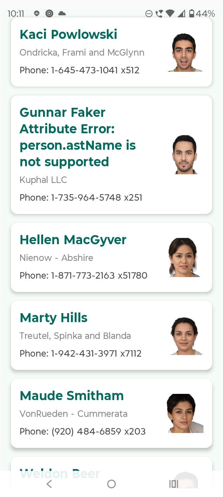
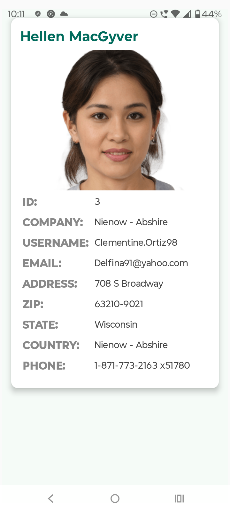

# ListUserScreen: Sample App to list user and its details. Based on mvi architecture with jetpack compose

[](https://kotlinlang.org/)
[](https://developer.android.com/jetpack/compose)
[](https://insert-koin.io/)
[](https://www.google.com/search?q=LICENSE)

## 🌟 Overview

This is a minimal Android application built using **Jetpack Compose** that demonstrates core Android architecture principles by implementing a **List-Detail** Android App. The project adheres to the **MVI (Model-View-Intent)** pattern for robust state management and uses **Koin** for dependency injection.

-----

## ✨ Features

  * **List Screen (Home)**: Displays a scrollable list of items fetched from a simulated API.
  * **Detail Screen**: Shows the complete details of a selected item.
  * **MVI State Management**: Handles asynchronous data loading, success, and error states using a generic `ResourceState<T>` sealed class.
  * **Safe Navigation**: Uses Compose Navigation to safely pass complex `Parcelable` data objects between screens.
  * **Unit Tested ViewModel**: Ensures business logic is reliable and easily verifiable.

-----

## 🖼️ App Demonstration

### 1\. The List Screen & Initial Loading

The List Screen handles the initial loading state (`ResourceState.Loading`) and displays the data upon successful retrieval.

| Initial Loading | Item List |
| :---: | :---: |
|  |  |

### 2\. The Detail Screen

Clicking an item navigates the user to the Detail Screen, passing the selected item's data safely via Navigation Arguments.


### 🎬 Video Walkthrough

A short video showcasing the complete user flow, including loading, selecting an item, and navigating back.

****

-----

## ⚙️ Architecture and Tech Stack

### Architecture:

  * **MVI (Model-View-Intent)**: Ensures a **unidirectional data flow (UDF)**, making state changes predictable and easy to debug.
  * **Layered Design**: Separated into Data, Domain (Repository), and Presentation (MVI/Compose).

### Key Technologies:

| Technology | Purpose |
| :--- | :--- |
| **Jetpack Compose** | Declarative UI for building native Android interfaces. |
| **Kotlin Coroutines** | Asynchronous programming and structured concurrency (using `Flow` and `viewModelScope`). |
| **Koin** | Lightweight dependency injection framework for managing services and ViewModels. |
| **Retrofit** | Type-safe HTTP client for API interactions. |
| **JUnit & Mockito** | Used for unit testing the ViewModel and Repository logic. |

-----

## 🛠️ Getting Started

### Prerequisites

  * Android Studio Jellyfish | 2023.3.1 or newer
  * JDK 17 or higher
  * An Android device or emulator running API 26 (Android 8.0) or later.

### Installation

1.  **Clone the repository:**
    ```bash
    git clone https://github.com/taranjeetsapra/ListUserTestApp.git
    ```
2.  **Open in Android Studio:**
    Open the cloned directory in Android Studio.
3.  **Sync and Build:**
    Allow Gradle to sync all dependencies. Click **Build \> Rebuild Project**.
4.  **Run:**
    Select an emulator or physical device and click the **Run** button (▶️).

-----

## 🧪 Testing

The project includes local unit tests for the presentation layer.

To run all ViewModel tests:

```bash
# In your project root directory:
./gradlew testDebugUnitTest
```

### Example Test Coverage

-----

## 📝 License

This project is licensed under the MIT License - see the [LICENSE](https://www.google.com/search?q=LICENSE) file for details.

-----
